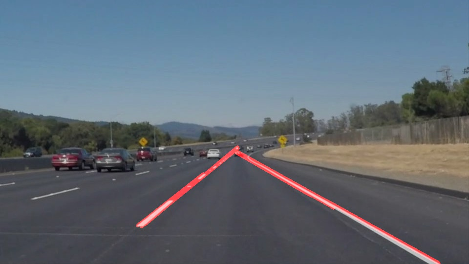
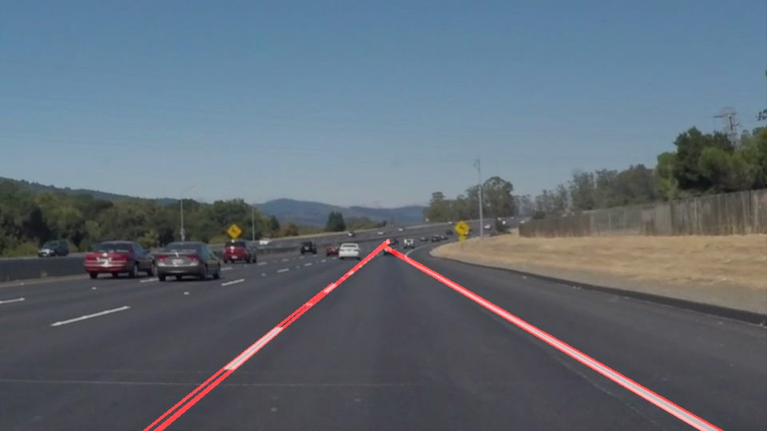
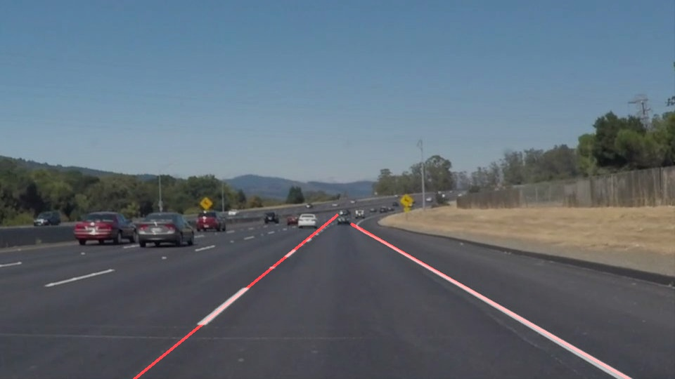

# **Finding Lane Lines on the Road** 

## Writeup

---

**Finding Lane Lines on the Road**

The goals / steps of this project are the following:

* Make a pipeline that finds lane lines on the road
* Reflect on your work in a written report

---

### Reflection

### 1. Describe your pipeline. As part of the description, explain how you modified the draw_lines() function.

My pipeline consisted of following steps:

- Grayscale the given image
- Add Gaussian blur to grayed image
- Apply canny transformation to find edges
- Mask out the unwanted region
- Apply Hough transformation

- 	Extend the hough transformed lines
	- Here we calculate slope and intercept a line and then we add extra points to extend it based on its slope and intercepts 

-  Average out the hough transformed lines to make it smooth
	- All the lines are divided into two gropus based on its slop
	- Lines having positiv slope is clubbed together
	- Lines having negative slopes are clubbed together
	- Mean of slopes and intercepts are taken of each category having different slopes
	- New points are generated based on this averaged slope and intercept  

- After applying previous steps `draw_line` method is called to just draw lines.
- Same pipeline is used for Video file as well

### 2. Identify potential shortcomings with your current pipeline

One of the obvious shortcoming is that it only tries to find straight lines and obviously fails when there is a turn and the expected curve should be a parabola.

### 3. Suggest possible improvements to your pipeline

- One possible improvement would be make several small line segments instead of making a big line segment after averaging. This might solve the problem when there is a trun.
- Hough transformed line should be extended and averaged in such a way that it forms a parabola when required(in case of a turn).
